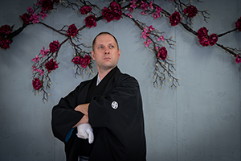

Якоимов Филипп  
============
  

Образование:
---------

2008-2012:  

:   **Информатика и Информационные технологии(педагогическое направление)**;  
**Бухарский Технологический Институт**(бакалавр)

----------

Опыт работы:
---------

2012-2022:  

:   **Узбекско-Японский Центр, представительство в г. Бухара**.  
**Занимал должности:** секретарь-кассир, секретарь, координатор культурной деятельности.

--------------------

В 2022 году уволился по собственному желанию, чтобы переучиться на программиста, с тех пор нигде не работаю
:   В данный момент учусь в Нетологии и очень надеюсь, что скоро начну зарабатывать,
    
Что умею на данный момент
----------------------------------------

|Владею языками: | |
| :------: | ----------- |
| Английский   | несколько лет назад подрабатывал гидом, сейчас особо ни с кем не общаюсь |
| Японский | Общаюсь на япоснком, но в основном, на бытовые темы |

|Другие навыки: | |
| :------: | ----------- |
| Blender   | 3д модели, доводилось делать дом по чертежам |
| 3dmax | после знакомства с Blender, я его забросил, но если надо, за пару дней восстановлю навыки |
| Python/Django | из курса нетологии и самостоятельно изучаю |

# Буду рад за любое сотрудничество.  
## Что положительного я в себе вижу:

1. Готов учить всё новое и переучитваться. Если по работе надо будет - выучу китайский язык или Ассемблер
2. Я люблю точность и конкретность в общении
3. Я владею мастерством Оригами, это многим нравится

| Контактные данные: |  |
| :------| -----------:|
| email    | robot-tyaga@yandex.ru |
| тел:  | +998-90-744-92-57 |
| страна    | Узбекистан |
